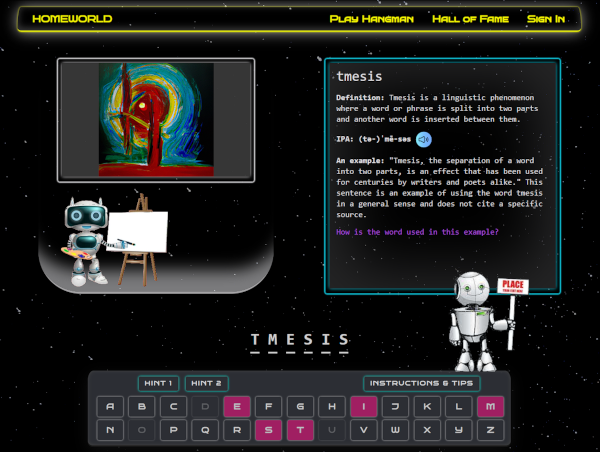

# Hangman Rescue Mission

Hangman is a web-based game built using the MERN stack (MongoDB, Express, React, Node.js). It is designed to provide an interactive and educational experience for learning English vocabulary and pronunciation while having fun.



## Features

- Randomly selects a word for the player to guess.
- ChatGPT provides hints, definitions, examples, and explanations related to the hidden word.
- OpenAI generates a painting based on the selected word.
- Uses Merriam-Webster's Collegiate® Dictionary for word confirmation and additional information, such as IPA and spoken pronunciation.
- Supports keyboard input for letter selection.
- Keeps track of the letters chosen by the player.
- Updates the remaining attempts and displays a message accordingly.
- Notifies the player when they win or lose the game.

## Demo

[Insert a link to your live demo or a video/gif demonstration of your Hangman game]

## Installation

1. Clone the repository:

   ```shell
   git clone [repository URL]

<ol start="2"><li><p>Open the project folder:</p><pre><div class="bg-black rounded-md mb-4"><div class="flex items-center relative text-gray-200 bg-gray-800 px-4 py-2 text-xs font-sans justify-between rounded-t-md"><span>shell</span><button class="flex ml-auto gap-2"><svg stroke="currentColor" fill="none" stroke-width="2" viewBox="0 0 24 24" stroke-linecap="round" stroke-linejoin="round" class="h-4 w-4" height="1em" width="1em" xmlns="http://www.w3.org/2000/svg"><path d="M16 4h2a2 2 0 0 1 2 2v14a2 2 0 0 1-2 2H6a2 2 0 0 1-2-2V6a2 2 0 0 1 2-2h2"></path><rect x="8" y="2" width="8" height="4" rx="1" ry="1"></rect></svg>Copy code</button></div><div class="p-4 overflow-y-auto"><code class="!whitespace-pre hljs language-shell">cd hangman-game
</code></div></div></pre></li><li><p>Install dependencies for the server:</p><pre><div class="bg-black rounded-md mb-4"><div class="flex items-center relative text-gray-200 bg-gray-800 px-4 py-2 text-xs font-sans justify-between rounded-t-md"><span>shell</span><button class="flex ml-auto gap-2"><svg stroke="currentColor" fill="none" stroke-width="2" viewBox="0 0 24 24" stroke-linecap="round" stroke-linejoin="round" class="h-4 w-4" height="1em" width="1em" xmlns="http://www.w3.org/2000/svg"><path d="M16 4h2a2 2 0 0 1 2 2v14a2 2 0 0 1-2 2H6a2 2 0 0 1-2-2V6a2 2 0 0 1 2-2h2"></path><rect x="8" y="2" width="8" height="4" rx="1" ry="1"></rect></svg>Copy code</button></div><div class="p-4 overflow-y-auto"><code class="!whitespace-pre hljs language-shell">cd server
npm install
</code></div></div></pre></li><li><p>Install dependencies for the client:</p><pre><div class="bg-black rounded-md mb-4"><div class="flex items-center relative text-gray-200 bg-gray-800 px-4 py-2 text-xs font-sans justify-between rounded-t-md"><span>shell</span><button class="flex ml-auto gap-2"><svg stroke="currentColor" fill="none" stroke-width="2" viewBox="0 0 24 24" stroke-linecap="round" stroke-linejoin="round" class="h-4 w-4" height="1em" width="1em" xmlns="http://www.w3.org/2000/svg"><path d="M16 4h2a2 2 0 0 1 2 2v14a2 2 0 0 1-2 2H6a2 2 0 0 1-2-2V6a2 2 0 0 1 2-2h2"></path><rect x="8" y="2" width="8" height="4" rx="1" ry="1"></rect></svg>Copy code</button></div><div class="p-4 overflow-y-auto"><code class="!whitespace-pre hljs language-shell">cd client
npm install
</code></div></div></pre></li><li><p>Start the server:</p><pre><div class="bg-black rounded-md mb-4"><div class="flex items-center relative text-gray-200 bg-gray-800 px-4 py-2 text-xs font-sans justify-between rounded-t-md"><span>shell</span><button class="flex ml-auto gap-2"><svg stroke="currentColor" fill="none" stroke-width="2" viewBox="0 0 24 24" stroke-linecap="round" stroke-linejoin="round" class="h-4 w-4" height="1em" width="1em" xmlns="http://www.w3.org/2000/svg"><path d="M16 4h2a2 2 0 0 1 2 2v14a2 2 0 0 1-2 2H6a2 2 0 0 1-2-2V6a2 2 0 0 1 2-2h2"></path><rect x="8" y="2" width="8" height="4" rx="1" ry="1"></rect></svg>Copy code</button></div><div class="p-4 overflow-y-auto"><code class="!whitespace-pre hljs language-shell">cd server
npm start
</code></div></div></pre></li><li><p>Start the client:</p><pre><div class="bg-black rounded-md mb-4"><div class="flex items-center relative text-gray-200 bg-gray-800 px-4 py-2 text-xs font-sans justify-between rounded-t-md"><span>shell</span><button class="flex ml-auto gap-2"><svg stroke="currentColor" fill="none" stroke-width="2" viewBox="0 0 24 24" stroke-linecap="round" stroke-linejoin="round" class="h-4 w-4" height="1em" width="1em" xmlns="http://www.w3.org/2000/svg"><path d="M16 4h2a2 2 0 0 1 2 2v14a2 2 0 0 1-2 2H6a2 2 0 0 1-2-2V6a2 2 0 0 1 2-2h2"></path><rect x="8" y="2" width="8" height="4" rx="1" ry="1"></rect></svg>Copy code</button></div><div class="p-4 overflow-y-auto"><code class="!whitespace-pre hljs language-shell">cd client
npm start
</code></div></div></pre></li><li><p>Open your preferred web browser and navigate to <code>http://localhost:3000</code> to access the Hangman game.</p></li></ol>

<h2>Usage</h2>

<ul><li>Press any letter key on your keyboard to choose a letter.</li><li>Guess the word by selecting letters until you find the complete word or run out of attempts.</li><li>ChatGPT provides hints, definitions, examples, and explanations related to the hidden word.</li><li>OpenAI generates a painting based on the selected word.</li><li>Merriam-Webster's Collegiate® Dictionary confirms the word exists and provides additional information.</li><li>The hangman figure will progressively appear as you make incorrect guesses.</li><li>The game will end when you correctly guess the word or exhaust all attempts.</li></ul>

<p>⚠️ <strong>Please Note</strong>: The information provided by ChatGPT is generated by an AI model and may be inaccurate. It must not be considered as factual information.</p>
<h2>Customization</h2>
<p>Feel free to customize the game according to your preferences. Here are a few ideas:</p>
<ul><li>Add more features to ChatGPT, such as providing synonyms, antonyms, or usage in different contexts.</li><li>Enhance the user interface with additional styling, animations, or interactive elements.</li><li>Implement different game modes or difficulty levels.</li><li>Expand the word database or allow players to add their own words for guessing.</li></ul>
<h2>Contributing</h2>
<p>Contributions are welcome! If you have any suggestions, bug reports, or feature requests, please open an issue or submit a pull request.</p>
<h2>License</h2>
<p>[Specify the license under which you're releasing your project]</p>
<h2>Acknowledgements</h2>
<ul><li>Merriam-Webster's Collegiate® Dictionary: [Insert appropriate credits or references]</li><li>OpenAI: [Insert appropriate credits or references]</li></ul>
<h2>Contact</h2>
<p>[Provide your contact information, such as your email or social media handles, so that users can reach out to you]</p>
