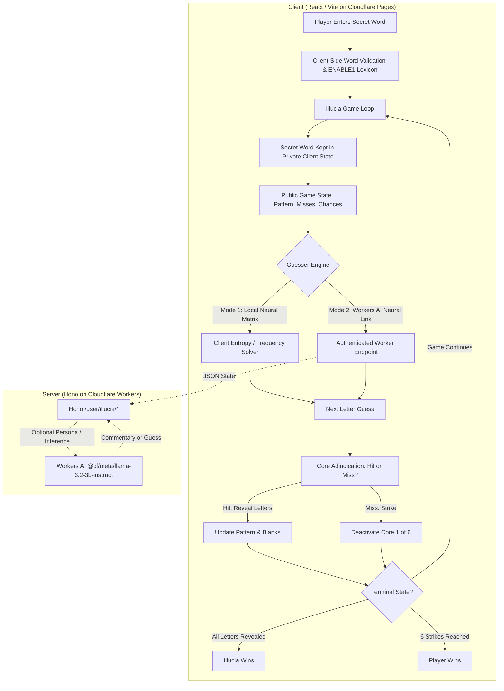
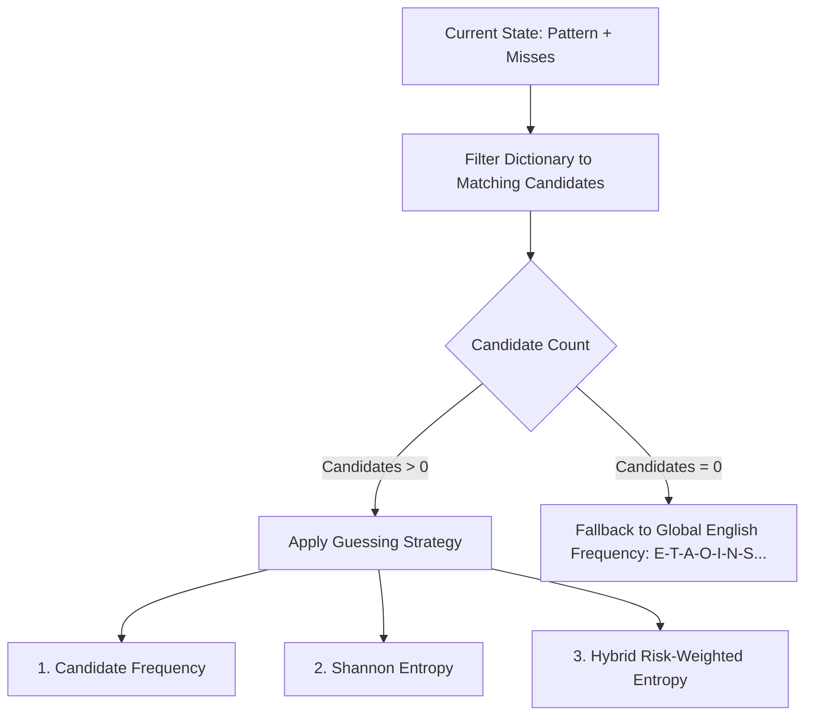

# Implementation Plan: Phase 4 — Illucia (Reverse Hangman)

## Goal Description
Implement **Illucia** (`/illucia`), the reverse Hangman game where the registered player chooses a secret English word and the AI character Illucia attempts to deduce it within six incorrect guesses.

This document presents a deep and thorough analysis of the options for the **Game Core**, the **Algorithmic Solver**, the **Model Layer** (including Cloudflare Workers AI integration and the zero-runtime-cost constraint), the **Dictionary & Lexicon Layer**, and the **UI/UX & Visual Layout** modeled after the existing Hangman game.



---

## User Review Required

> [!IMPORTANT]
> **Hard Rule Alignment (Zero Live Third-Party API Calls vs Workers AI):**
> Current `CLAUDE.md` Hard Rule 2 strictly forbids live third-party API calls at runtime to keep running cost at $0. Cloudflare Workers AI is native to Cloudflare, but the Free Tier is capped at **10,000 neurons/day**.
> - An algorithmic solver running in the browser costs **$0**, has **zero latency**, never exhausts quotas, and achieves up to **94% win rate**.
> - A live Workers AI model call consumes ~50–200 neurons per turn. At ~10–15 turns per game, a daily 10k neuron limit could be exhausted after only **5–20 full games** across the entire site.
> - **Recommendation:** Adopt the **Neuro-Symbolic Hybrid / Dual-Engine** approach (detailed below): the core letter deduction is driven by the algorithmic solver (or client worker), while an authenticated Cloudflare Workers AI endpoint is used optionally for dynamic personality/commentary with automatic fallback to scripted Asimov-themed dialogue when quotas are reached or when offline.

> [!WARNING]
> **Why Raw LLMs Fail as Direct Hangman Guessers:**
> Academic benchmarks (such as the 2026 *Private State Interactive Tasks* studies) and empirical tests demonstrate that raw LLMs (LLaMA, Mistral, Gemma) perform poorly when directly guessing letters in Hangman (win rates below 40%). LLM tokenizers (BPE/SentencePiece) operate on sub-word tokens rather than individual characters, making them prone to:
> 1. Guessing already-used letters.
> 2. Guessing letters not present in any valid matching English word.
> 3. Hallucinating word structures that do not match the revealed blanks.
> Any architecture involving an LLM must have an algorithmic constraint layer or solver backing it.

---

## Deep Research & Options Analysis

### 1. Game Core & Rules Layer

| Component | Specification | Technical Rationale |
| :--- | :--- | :--- |
| **Word Length** | 3 to 12 characters (recommended default: 4 to 10) | Words shorter than 3 are trivial; words longer than 12 are rare and degrade mobile UI fit. |
| **Character Set** | English A–Z only, case-insensitive (normalized to uppercase) | Disallow hyphens, apostrophes, digits, and spaces in v1 to preserve parity with Hangman. |
| **Chances** | 6 incorrect guesses (strikes), not 6 total turns | Matches `App.js` Hangman rules: hits reveal all occurrences without penalty. |
| **State Privacy** | Client-authoritative private answer | The secret word is **never** sent to the guesser or the model prompt; only `{ pattern, misses, wordLength, guessedLetters }` are exposed. |
| **Adjudication** | Pure deterministic JavaScript code | Adjudication (matching indices, strike counting, win/loss check) is never delegated to an AI model. |

---

### 2. Dictionary & Word Validation Layer

To ensure the game is fair and solvable, the player's secret word must be a real English word.

#### Options for Lexicon:
1. **ENABLE1 (Enhanced North American Benchmark Lexicon)**:
   - **Size**: ~172,820 words. Filtered to 3–12 characters: ~165,000 words.
   - **Licensing**: Public Domain. Standard reference for Words with Friends, Scrabble tools, and word games.
   - **Delivery**: Plain text or JSON (~1.8 MB raw, compresses to ~420 KB with Gzip/Brotli on Cloudflare CDN).
   - **Loading**: Lazy-loaded via dynamic `import()` on `/illucia` only (code-split, 0 bytes loaded on `/` or `/hangman`).
2. **SCOWL / Curated Common (35,000–50,000 words)**:
   - **Size**: ~45,000 words (~120 KB gzipped).
   - **Pros**: Excludes ultra-obscure archaic Scrabble hooks (e.g., `AA`, `QAT`, `XYLYL`), making solver guesses align with human intuition.
   - **Cons**: Might reject a rare but valid word chosen by an advanced player.
3. **Recommendation**:
   - Primary: **ENABLE1** (public domain, complete).
   - Optional dual-pass: Fast lookup via `Set` in JavaScript ($O(1)$ lookup time, < 5ms initialization).

---

### 3. Solver Algorithms Comparison (The Game Engine)

How should Illucia choose her next letter?



#### Detailed Comparison of Solvers:

| Strategy | Algorithm / Math | Win Rate | Latency | Behavior & Characteristics |
| :--- | :--- | :--- | :--- | :--- |
| **1. Dynamic Candidate Frequency** | $Score(c) = \sum_{w \in C} \mathbb{I}(c \in w)$<br>Picks letter occurring in most remaining candidates. | ~82–85% | < 2 ms | Maximizes the probability that the next turn is a **HIT**. Plays like an expert human. Susceptible to "word families" (e.g., `_ A T` -> `BAT`, `CAT`, `FAT`, `HAT`, `MAT`, `PAT`, `RAT`). |
| **2. Shannon Entropy (Information Gain)** | $H(c) = -\sum_{i} p_i \log_2(p_i)$<br>Partitions candidates by response pattern (miss, pos 0, pos 1, etc.). | ~89–92% | ~10–25 ms | Maximizes reduction in candidate entropy per turn. Cuts through word families by guessing common consonants that differentiate candidates. |
| **3. Risk-Weighted Hybrid Entropy (Optimal)** | $Score(c) = H(c) + \lambda(\text{strikesLeft}) \cdot P(\text{Hit} \mid c)$<br>$\lambda$ scales inversely with remaining lives. | ~93–96% | ~15–30 ms | High entropy when lives are plentiful (explores efficiently); transitions to maximum hit probability when 1–2 strikes remain (defends against game over). |
| **4. Multi-Tier Difficulty Engines** | User selects: **Novice** (Global frequency + noise), **Scholar** (Candidate frequency), or **Grandmaster** (Risk Entropy). | 55% to 95% | < 30 ms | Gives the player agency over the challenge level. |

---

### 4. Model Layer Options (Workers AI vs Local vs Hybrid)

| Option | Architecture | Cloudflare Quota / Cost | Latency | Reliability & Feasibility |
| :--- | :--- | :--- | :--- | :--- |
| **Option A: Pure Local Engine (Zero-Inference)** | Deterministic solver runs in browser/Web Worker. Lore & dialogue powered by scripted contextual bank. | **$0** (0 neurons) | **< 5 ms** | **100% reliable**, zero dependencies, zero network calls, strictly adheres to existing Hard Rules. |
| **Option B: Pure Workers AI Letter Guesser** | Worker calls `@cf/meta/llama-3.2-3b-instruct` on each turn to produce the letter. | 50–200 neurons/turn (~1500 neurons/game). **Exhausts 10k quota in ~7 games/day**. | 1.5–3.0 s per turn | **High risk**: Sub-40% accuracy, high latency, quota failures frequent. Requires Hard Rule amendment. |
| **Option C: Neuro-Symbolic Hybrid (Recommended)** | Solver selects the optimal letter; Workers AI is invoked asynchronously to generate **persona commentary & banter** for key milestones (opening, strikes, near-victory, game over). | ~100 neurons per match (commentary batched/throttled). Up to 100 games/day. | Asynchronous (does not block turn gameplay) | **High engagement**: Combines mathematical gameplay excellence with living AI personality. Seamless fallback to scripted dialogue when quota expires. |
| **Option D: Dual-Engine Switch** | UI toggle: `[Local Quantum Core]` vs `[Cloud Workers AI Link]`. Player chooses their opponent backend. | $0 in Local mode; standard quota in Cloud mode. | Instant in Local; 1–2s in Cloud. | Maximum flexibility; allows comparing raw LLM play against the mathematical solver. |

---

### 5. UI/UX Design & Layout (Visual Parity with Hangman)

The UI must fit seamlessly into the existing visual style established in `App.css`, `Navbar.js`, `Figure.js`, and `Wordfacts.js`.

#### Screen Comparison & Layout Map

```
HANGMAN PAGE (/hangman)                       ILLUCIA PAGE (/illucia)
┌──────────────────────────────────────┐     ┌──────────────────────────────────────┐
│  [NAVBAR: HOMEWORLD | HANGMAN | ...] │     │  [NAVBAR: HOMEWORLD | HANGMAN | ...] │
├──────────────────────────────────────┤     ├──────────────────────────────────────┤
│  LEFT BOX:            RIGHT BOX:     │     │  LEFT BOX:            RIGHT BOX:     │
│  ┌────────────────┐  ┌─────────────┐ │     │  ┌────────────────┐  ┌─────────────┐ │
│  │ Artwork Screen │  │ Wordfacts / │ │     │  │ Illucia Avatar │  │ Neural Log  │ │
│  │ (Canvas frame) │  │ Tips Panel  │ │     │  │ Holo-Display   │  │ & Thoughts  │ │
│  │ [Artsy Robot]  │  │ [Han AI]    │ │     │  │ [Core Matrix]  │  │ [Terminal]  │ │
│  └────────────────┘  └─────────────┘ │     │  └────────────────┘  └─────────────┘ │
│                                      │     │                                      │
│  CENTER:                             │     │  CENTER:                             │
│  Word Blanks:  _ _ _ _ _ _           │     │  Word Blanks:  _ _ _ _ _ _           │
│                                      │     │                                      │
│  BOTTOM DECK:                        │     │  BOTTOM DECK:                        │
│  ┌─────────────────────────────────┐ │     │  ┌─────────────────────────────────┐ │
│  │ [HINT 1] [HINT 2] [TIPS]        │ │     │  │ [NEXT GUESS] [AUTO-PLAY] [SURR] │ │
│  │ [A][B][C]...[X][Y][Z] (Input)   │ │     │  │ [A-Z STATUS GRID: HIT/MISS/IDLE]│ │
│  │ (Flips on Game Over to Replay)  │ │     │  │ (Flips on Game Over to Replay)  │ │
│  └─────────────────────────────────┘ │     │  └─────────────────────────────────┘ │
└──────────────────────────────────────┘     └──────────────────────────────────────┘
```

#### Detailed UI Component Specifications for Illucia:

1. **Phase 1: Setup Console (Docking Phase)**:
   - Centered terminal panel matching the cyan/purple glow of `Wordfacts`.
   - Heading: `CHALLENGE ILLUCIA · AURORA CYBERNETICS`.
   - Secret word input with:
     - Real-time validity indicator (checks ENABLE1 dictionary: green check for recognized, red for unknown).
     - Character length counter (e.g., `6 / 12 letters`).
     - "Mask / Unmask" eye toggle (to conceal the secret word from shoulder surfers).
     - "Surprise Me" / Random generator button (picks a word from the manifest for quick testing).
     - Difficulty selector: `Novice` / `Scholar` / `Grandmaster`.
     - Primary button: `INITIALIZE DUEL`.

2. **Phase 2: Duel Arena (Live Gameplay)**:
   - **Left Box — Illucia Holo-Display**:
     - Sci-fi portrait/frame matching the dimensions of `Figure.js` (288px width).
     - **Synaptic Core / Strike Meter**: 6 glowing plasma nodes.
       - Healthy: glowing violet/cyan `[●]`.
       - Depleted: shattered dark red `[✕]`.
     - Current guess callout: e.g., `GUESS: [ R ]` with pulse glow.
   - **Right Box — Illucia's Neural Log**:
     - Terminal styled after `Wordfacts.js` with typewriter effect.
     - Metrics: Candidate words remaining (e.g. `14,208 → 412 → 18`), entropy confidence rating.
     - In-character commentary line (Isaac Asimov lore: Aurora, linguistics, Han Fastolfe's daughter).
   - **Center — Revealed Word Blanks**:
     - Reuses the `Word.js` component styling with glowing letters for hits and underlines for unrevealed slots.
   - **Bottom Deck — Neural Matrix & Controls**:
     - Top bar: `NEXT TURN` (step-by-step), `AUTO-PLAY` (toggle between 1s/turn, 2s/turn, or manual), `GIVE UP`.
     - Letter Grid: Full 26-letter keyboard layout where keys act as **readouts**:
       - Green/Gold glow: Confirmed Hit.
       - Red struck-through: Confirmed Miss.
       - Neutral: Unused letter.

3. **Phase 3: Resolution & 3D Replay Card Flip**:
   - Reuses the 3D flip card animation from `Keyboard.js` (`.flipped` class).
   - Back of card displays:
     - Outcome: `ILLUCIA VICTORIOUS` or `HUMAN TRIUMPH`.
     - Efficiency stats: Turn count, strike count, final word.
     - Buttons: `PLAY AGAIN` (resets state) and `HALL OF FAME`.

---

## Open Questions

> [!IMPORTANT]
> **Decision 1: Model Layer Selection**
> Which model layer strategy do you prefer for the initial Phase 4 release?
> - **Recommendation (Option C)**: Local Risk-Entropy Solver for 100% reliable letter guessing, with optional Workers AI for dynamic character banter + rich scripted fallback.
> - **Option A**: 100% Local / Zero-Inference (pure deterministic solver + scripted lore lines, zero API calls, $0 forever).
> - **Option D**: Dual-Engine Switch (give the player a toggle between "Local Quantum Core" and "Cloud Workers AI").

> [!NOTE]
> **Decision 2: Turn Progression (Manual vs Auto-Play)**
> Should Illucia guess automatically on a timer (e.g., 1.5 seconds per turn with an Auto/Pause button), or should the player click "Next Guess" to advance turn-by-turn?
> - **Recommendation**: Provide both! Default to step-by-step with an "Auto-Play" toggle so players can choose their preferred pace.

> [!NOTE]
> **Decision 3: Secret Word Input Restrictions**
> Should words strictly require validation in the dictionary (ENABLE1), or should players be allowed to play custom words with a warning ("Word not in Aurora archives, solver may struggle")?
> - **Recommendation**: Require valid dictionary words in standard mode, with an optional "Freeform / Experimental" toggle for advanced users.

---

## Proposed Changes & File Map

### Shared & Core Logic Layer
Grouped logically, separated from UI:

#### [NEW] `client/src/lib/hangman-core.js`
- Pure, headless Hangman adjudication functions.
- Exports: `createGameState(secretWord)`, `applyGuess(state, letter)`, `isGameTerminal(state)`.
- Reused by both Hangman and Illucia to eliminate code duplication.

#### [NEW] `client/src/lib/illucia-solver.js`
- Candidate filtering engine: matches length, pattern, excluded letters, and blank constraints.
- Heuristics:
  - `getCandidateFrequency(candidates, unusedLetters)`
  - `getEntropyScores(candidates, unusedLetters)`
  - `getBestGuess(candidates, unusedLetters, strikesLeft, difficulty)`

#### [NEW] `client/src/lib/dictionary.js`
- Lazy-loads and indexes the ENABLE1 lexicon by word length.
- Provides `isValidWord(word)` and `getCandidatesByLength(len)`.

#### [NEW] `client/src/data/enable1.json` (or `.txt`)
- Filtered word list (lengths 3–12) for client-side loading.

---

### Component Layer

#### [MODIFY] `client/src/Components/Illucia.js`
- Replace placeholder with full three-phase component (Setup, Duel, Game Over).
- Integrates `useAuth()` (keeps existing gate).
- Renders `IlluciaSetup`, `IlluciaStage`, `IlluciaTerminal`, `IlluciaDeck`.

#### [NEW] `client/src/Components/IlluciaFigure.js`
- Renders Illucia's holo-avatar, 6 synaptic core plasma nodes, and strike animations.

#### [NEW] `client/src/Components/IlluciaTerminal.js`
- Renders the neural mind terminal, search space metrics, and in-character dialogue.

#### [NEW] `client/src/Components/IlluciaDeck.js`
- Renders the 26-letter readout matrix, step/auto controls, and 3D replay flip card.

#### [MODIFY] `client/src/App.css`
- Add dedicated styles for `.illuciastage`, `.synaptic-core`, `.neural-terminal`, `.deck-readout`.
- Responsive breakpoints for mobile (max-width: 800px) and tablet (max-width: 1280px).

---

### Optional Server Layer (If Workers AI Option C or D is Approved)

#### [MODIFY] `server/wrangler.jsonc`
- Add Workers AI binding: `"ai": { "binding": "AI" }`.
- Add route if needed or mount under existing `/user/*` prefix: `/user/illucia/commentary`.

#### [MODIFY] `server/src/index.ts`
- Add authenticated endpoint `POST /user/illucia/commentary` calling `@cf/meta/llama-3.2-3b-instruct` with strict body limits, rate limits, and fallback.

---

## Verification Plan

### Automated Tests
1. **Core Adjudication Tests** (`client/src/lib/hangman-core.test.js`):
   - Single and multiple letter occurrences.
   - Miss strike decrement (exact 6-life boundary).
   - Terminal win and loss state transitions.
   - Non-alphabetic and repeated-letter rejection.
2. **Solver Accuracy & Performance Tests** (`client/src/lib/illucia-solver.test.js`):
   - Candidate filtering accuracy against known patterns (e.g. `_ A _ E`).
   - Entropy calculation correctness on sample word buckets.
   - Execution benchmark: < 30ms for full dictionary pass.
3. **Component UI Tests** (`client/src/Components/illucia.test.jsx`):
   - Word input validation and submission.
   - Turn-by-turn state progression and readout updates.
   - Strike deactivation on miss.
   - Flip card appearance on win/loss.
   - Unauthenticated redirect to login (preserving existing test).

### Manual Browser Verification
1. Desktop and mobile viewports (Chrome, Firefox, Safari/iOS).
2. Inputting valid, invalid, and boundary-length words (3, 6, 12 letters).
3. Playing a complete game to victory (human win) and loss (Illucia win).
4. Verifying audio, visual feedback, and smooth 3D flip card animations.
