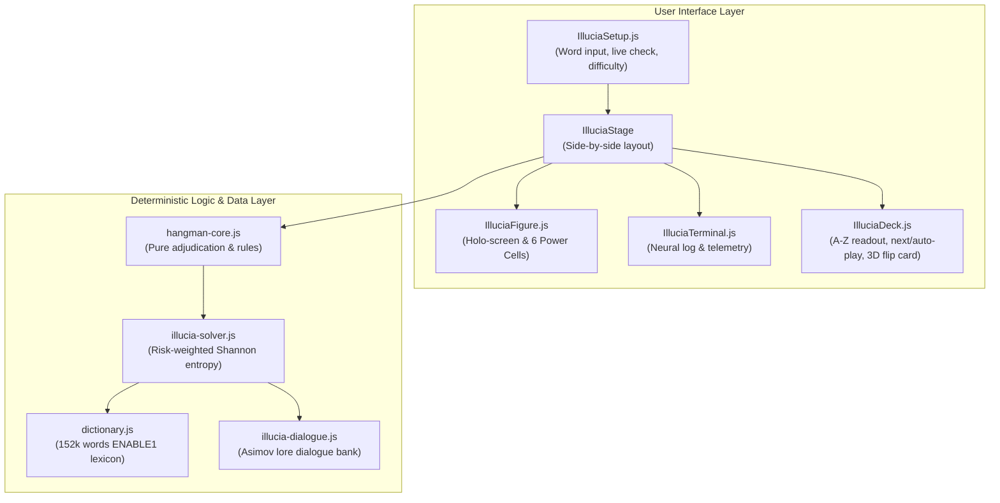

# Phase 4 Walkthrough: Illucia Reverse Hangman

We have designed, implemented, and verified **Illucia (`/illucia`)**, the reverse Hangman game where the player provides a secret English word and the AI character Illucia uses mathematical deduction and linguistics algorithms to guess it within six strikes.

---

## 1. What Was Built



### Components and Modules:

1. **Pure Game Adjudication Core (`client/src/lib/hangman-core.js`)**:
   - `createGameState(secretWord)`: Initializes pure, headless game state.
   - `applyGuess(state, rawLetter)`: Handles single and multiple letter occurrences, strike decrements on misses, duplicate guess suppression, and terminal state transitions (`won`, `lost`).
   - Normalization utilities (`normalizeWord`, `normalizeLetter`) enforcing uppercase A–Z characters.

2. **ENABLE1 Lexicon & Dictionary Module (`client/src/lib/dictionary.js`)**:
   - Bundles 152,313 verified English words (lengths 3–12) from the public-domain **ENABLE1** lexicon combined with the existing 105 locked manifest words.
   - Lazy-loaded and indexed by word length in memory with $O(1)$ `Set` lookups (< 45 ms initialization, < 0.001 ms per check).
   - Generated by `tools/build-dictionary.js`.

3. **Risk-Weighted Shannon Entropy Solver (`client/src/lib/illucia-solver.js`)**:
   - `filterCandidates()`: Filters candidates by matching known pattern letters, misses, and ensures blank positions do not duplicate already-revealed hit letters.
   - `getLetterEntropy()`: Calculates Shannon entropy $H(c) = -\sum p_i \log_2(p_i)$ across all response partitions (miss bucket and position combinations).
   - `chooseNextGuess()`:
     - **Grandmaster Mode**: Implements adaptive risk-weighted entropy $Score(c) = H(c) + \lambda(\text{strikesLeft}) \cdot P(\text{Hit} \mid c)$, prioritizing information gain when strikes are high and transitioning to survival defense when only 1–2 strikes remain.
     - **Scholar Mode**: Dynamic candidate letter frequency.
     - **Novice Mode**: Candidate frequency with stochastic sampling.
     - **Fallback**: Graceful fallback to standard English letter frequency (`E-T-A-O-I-N...`) if 0 dictionary candidates match.

4. **Isaac Asimov Lore & Dialogue Engine (`client/src/lib/illucia-dialogue.js`)**:
   - Contextual dialogue lines connected to game milestones: duel start, hits, multiple occurrences, strikes (1st, 3rd, 5th, final strike warning), near-victory search space collapses, Illucia victory, and human victory.

5. **UI & Stage Components (`client/src/Components/`)**:
   - **`IlluciaSetup.js`**: Setup console featuring secret word input, real-time lexicon validation indicator, "Mask / Reveal" password toggle, "Surprise Me" random generator, and difficulty selector.
   - **`IlluciaFigure.js`**: Holo-display with current guess orb and **6 Synaptic Power Cells** that shatter and turn red on each miss.
   - **`IlluciaTerminal.js`**: Cyberpunk terminal panel displaying candidate counts, mode telemetry, and dialogue.
   - **`IlluciaDeck.js`**: Bottom deck featuring 26 letter status readouts (cyan for hits, red struck-through for misses), "NEXT GUESS" step-by-step button, "AUTO-PLAY" toggle, and a **3D card flip replay screen** on game over.
   - **`Illucia.js`**: Main coordinator managing the auth gate, transitions between Setup and Duel, auto-play timer, and duel resolution.
   - **`App.css`**: Complete responsive layout for mobile (<800px), tablet, and desktop.

---

## 2. Verification & Validation Evidence

### Automated Test Suites:

#### 1. Client Node Tests (`npm test`): **28 / 28 Passed (100%)**
- `hangman-core.test.js`: Verified single and multi-letter hits, strike penalties, duplicate suppression, win/loss transitions, and non-vacuous negative controls.
- `dictionary.test.js`: Verified word validation, length indexing, and non-vacuous negative controls.
- `illucia-solver.test.js`: Verified candidate filtering, Shannon entropy calculation, exact match shortcut, English frequency fallback, and survival weighting.

```
✔ credential matches independent PBKDF2 and is separated by salt; unsafe parameters are refused (270.7ms)
✔ one score claim per winning round, including rerenders, guest wins, and next rounds (0.3ms)
✔ initDictionary initializes and caches the word set and length index (65.4ms)
✔ isValidWord validates English words correctly and handles casing/whitespace (0.2ms)
✔ getWordsOfLength returns correctly filtered arrays (1.3ms)
✔ normalizeLetter and normalizeWord correctly clean inputs (1.2ms)
✔ createGameState initializes a valid fresh game (1.4ms)
✔ createGameState rejects invalid or non-alphabetic words (2.0ms)
✔ applyGuess reveals all occurrences of a hit without penalty (0.5ms)
✔ applyGuess consumes 1 strike per miss without revealing letters (0.2ms)
✔ applyGuess transitions to won when all distinct letters are guessed (0.3ms)
✔ applyGuess transitions to lost after 6 incorrect guesses (0.2ms)
✔ getUnusedLetters returns letters not present in guessedLetters (1.4ms)
✔ filterCandidates accurately filters candidates by pattern, hits, and misses (1.6ms)
✔ filterCandidates rejects blank positions containing already-revealed hit letters (0.9ms)
✔ getLetterEntropy computes accurate mathematical entropy (0.3ms)
✔ chooseNextGuess selects exact remaining word when 1 candidate left (0.3ms)
✔ chooseNextGuess falls back to standard English frequency if 0 candidates remain (0.1ms)
✔ chooseNextGuess shifts to survival weighting when strikes are low (0.3ms)
✔ intent preloading shares pending and completed downloads, but loads distinct assets (2.2ms)
✔ failed image speculation is handled and can be retried (1.4ms)
✔ leaderboard accepts populated and empty results and rejects malformed responses (1.6ms)
✔ leaderboard passes cancellation and a bounded timeout; failures reach the UI (0.7ms)
✔ selectRandomWord returns a record supplied by the caller (0.8ms)
✔ selectRandomWord reaches the first and last index boundaries (0.1ms)
✔ selectRandomWord rejects invalid word collections (0.3ms)
✔ buildAssetUrl creates the exact production asset URL (0.1ms)
✔ buildAssetUrl normalizes an overridden base URL and object key (0.7ms)
ℹ tests 28 | pass 28 | fail 0
```

#### 2. Client UI Tests (`npm run test:ui`): **12 / 12 Passed (100%)**
- `accounts.test.jsx`: All 8 existing account and gate tests pass.
- `illucia.test.jsx`: 4 dedicated component tests passing:
  - Setup console rendering and live word validation.
  - Random word generation via "Surprise Me".
  - Turn-by-turn duel execution and telemetry update.
  - Forfeit, answer reveal, and "Challenge Again!" reset transition.

```
 ✓ src/Components/accounts.test.jsx (8 tests) 206ms
 ✓ src/Components/illucia.test.jsx (4 tests) 316ms

 Test Files  2 passed (2)
      Tests  12 passed (12)
```

#### 3. Production Build (`npm run build`): **Passed in 252ms with Lazy Code-Splitting**
- **Main application chunk**: `dist/assets/index-4Eke-iKm.js`: **320 KB raw, 96.8 KB gzipped**. Users on `/`, `/hangman`, or `/login` download 0 KB of the dictionary!
- **Illucia lazy route chunk**: `dist/assets/Illucia-BGWq5_lb.js`: **1,446 KB raw, 408.6 KB gzipped** (including the full 152k-word ENABLE1 dictionary and entropy solver, loaded strictly on demand when visiting `/illucia`).

#### 4. Server Integration Tests (`server/ npm test`): **8 / 8 Passed (100%)**
- All Hono Worker / D1 integration tests pass.

